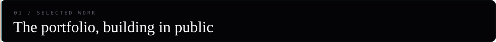
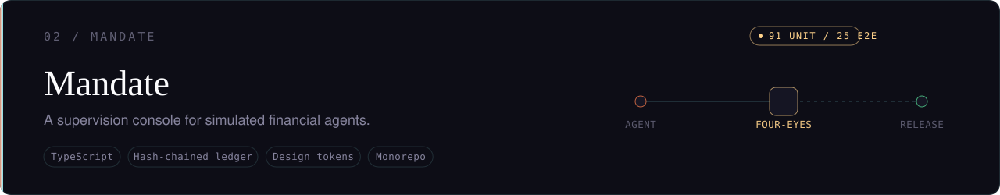
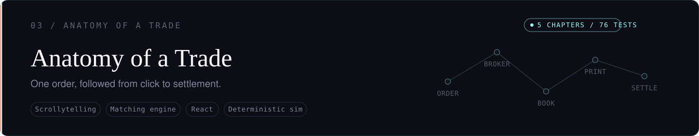
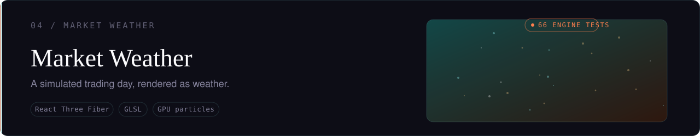
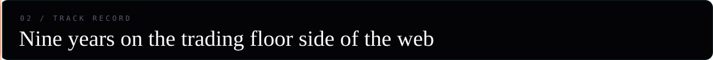
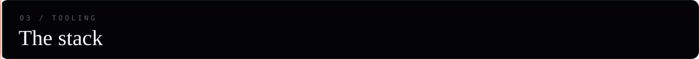
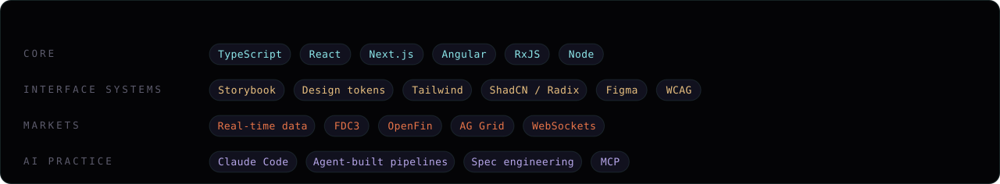

  

 

I build interfaces for people who watch markets for a living — screens where a dropped frame is a defect and a misread number costs money. Nine years of production front-end work, most of it inside financial systems: real-time trading UIs at Adaptive Financial Consulting, and Frame.io's first design system, which I set up in Storybook. I contributed to the FDC3 desktop interoperability standard and spoke about it at a FinJS conference. These days I run <a href="https://codeclarity.ai">Code &amp; Clarity</a>, an AI consulting practice in New York, and I'm building the portfolio below in public.

<!-- TODO: point each card at its repo once public (see SETUP.md) -->

  

  

  

  

Each of these starts as a full build specification — rubric-gated and adversarially reviewed before a line of code exists — then gets built by Claude Code agent swarms against that spec, with deterministic engines and green test suites as the acceptance bar. The specs are part of the portfolio: writing one an agent can execute without supervision turns out to be a design discipline of its own.

 

| | | |
|---:|:---|:---|
| `2025 —` | **Code & Clarity** | Founder. AI strategy and implementation for organizations that want engineering rigor behind their AI adoption. |
| `2019 – 2025` | **Adaptive Financial Consulting** | Front-end consultant on real-time trading systems for financial institutions. Deep Angular and React, including converting a full legacy Angular application to React, and writing the onboarding material that cross-trained React developers onto Angular. Co-managed the developer training program; roughly 80% of Adaptive's developer consultants came through it. |
| | **Frame.io** | Set up the company's first design system in Storybook. |
| | **Giant Machines** | Desktop fintech applications on OpenFin. |
| | **Before code** | Fashion editorial. The eye for composition survived the career change. |

 

  

Held opinion: React with TypeScript, Next.js, ShadCN and Tailwind is currently the most AI-legible stack: components an agent can read and extend, with theming centralized in one place so it stays maintainable.

  

 

  &nbsp;
  &nbsp;
  <!-- TODO: replace with your LinkedIn URL -->
  &nbsp;
  <!-- TODO: link a hosted copy of your résumé -->
  

 

  Every visual on this page is a hand-built animated SVG — Cormorant Garamond and Outfit subsetted and embedded, motion disabled for <code>prefers-reduced-motion</code>. The profile is part of the portfolio.

